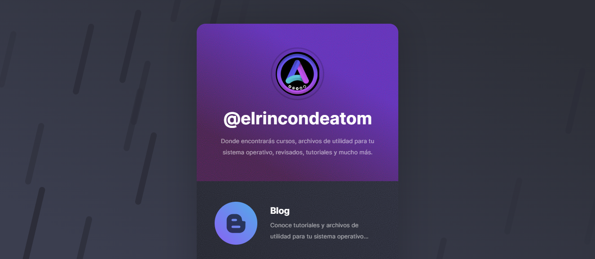

Web Profile

https://elrincondeatom-profile.netlify.app/

Landing page responsive creada con HTML. Excelente si lo que deseas es mostrar un breve descripción de tu proyecto o lo que haces.

---

### Capturas de pantalla de la

---

### Hola, [AtomWhyred][website] por aquí 

 [][tlg]

---
### LOVE, DEV, TELEGRAM

- 🔭 Actualmente me estoy superando para ser un gran desarrollador.
- 👯 Estoy colaborando en varios grupos y canales en Telegram.
- ⚡ Me gusta: estudiar, programación, android, linux y las criptomonedas.
- 📫 Correo: elrincondeatom@gmail.com

---

<!-- Links -->
[website]: https://elrincondeatom.com/
[tlg]: https://t.me/elrincondeatom_com
